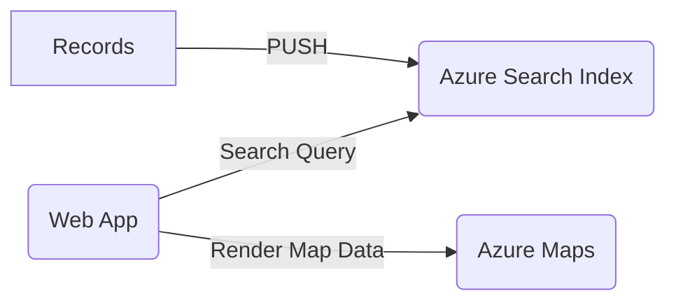

# Geosearch

- geospatial search accelerator

## BOM

- Azure Maps
- Azure Search

## Architecture

## FrontEnd - Azure Maps

- Azure Maps front end app adapted from https://github.com/Azure-Samples/AzureMapsCodeSamples/tree/main/Samples/Tutorials/Simple%20Store%20Locator 

## BackEnd - Azure Search

- Azure AI Search quickstart adapted from https://learn.microsoft.com/en-us/azure/search/samples-rest 