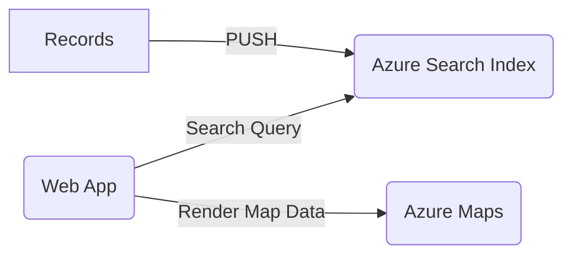

# Geosearch

A simple geospatial search accelerator

> TODO: add 'deploy to Azure' button. For now, see [Quickstart](./docs/Quickstart.md)

## BOM

- Azure Maps
- Azure Search
- Azure Cognitive Services (https://aka.ms/csrainotice)
- Azure Storage

## Quickstart
:rocket: [Quickstart](./docs/Quickstart.md)

## Architecture

## FrontEnd - Azure Maps

- Azure Maps front end app adapted from https://github.com/Azure-Samples/AzureMapsCodeSamples/tree/main/Samples/Tutorials/Simple%20Store%20Locator 

## BackEnd - Azure Search

- Azure AI Search management and definitions adapted from https://learn.microsoft.com/en-us/azure/search/samples-rest 

## Testing and Search Managememt Plane

The [search/manaagement](./search/management) and [search/test](./search/test) folders use the VSCode REST Client extension ([docs](https://marketplace.visualstudio.com/items?itemName=humao.rest-client)) to set up and test the Azure Search API.

> See here for a take on the VSCode Rest Client as an alternative to Postman https://danielabaron.me/blog/postman-alternative-vscode/

## Data pipelines and indexer logic

### Opportunities for further scenarios
- [] pre-process blob metadata https://learn.microsoft.com/en-us/azure/storage/blobs/storage-blob-properties-metadata-python
- [] multiple indexers https://learn.microsoft.com/en-us/azure/architecture/ai-ml/architecture/search-blob-metadata  

